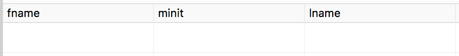

# Homework 4 problems 

CS 4092, Summer 2018

Martina Desender (M07771641) and Hayden Schiff (M12752592)

## Problem 8

employee last name and project name for employees who have at least one dependent and work on a project at least 17 hours

```sql
SELECT e.lname,
       p.pname
FROM employee e,
     project p,
     works_on w
WHERE e.ssn = w.essn
  AND p.pnumber = w.pno
  AND w.hours >= 17
  AND e.ssn IN
    (SELECT DISTINCT essn
     FROM dependent);
```


## Problem 9

employee last names for employees who do not work on any projects.

```sql
SELECT lname
FROM employee
WHERE ssn NOT IN
    (SELECT essn
     FROM works_on
     WHERE employee.ssn = works_on.essn); 
```


## Problem 10

employee last names who have a child the same sex as they are.

```sql
SELECT lname
FROM employee
WHERE ssn IN
    (SELECT essn
     FROM dependent
     WHERE employee.ssn = dependent.essn
       AND employee.sex = dependent.sex
       AND (relationship = 'Son'
            OR relationship = 'Daughter'));
```


## Problem 11

employee last names for employees who do not have a child of the same sex as themselves.

```sql
SELECT lname
FROM employee
WHERE ssn NOT IN
    (SELECT essn
     FROM dependent
     WHERE employee.ssn = dependent.essn
       AND employee.sex = dependent.sex
       AND (relationship = 'Son'
            OR relationship = 'Daughter'));
```


## Problem a

Retrieve the names of employees in department 5 who work more than 10 hours per week on the 'ProductX' project.

```sql
SELECT e.fname,
       e.minit,
       e.lname
FROM employee e,
     works_on w,
     project p
WHERE e.ssn = w.essn
  AND e.dno = 5
  AND w.hours > 10
  AND w.pno = p.pnumber
  AND p.pname = 'ProductX';
```


## Problem b

List the names of employees who have a dependent with the same first name as themselves.

```sql
SELECT e.fname,
       e.minit,
       e.lname
FROM employee e,
     dependent d
WHERE e.ssn = d.essn
  AND e.fname = d.dependent_name;
```


## Problem c

Find the names of employees who are directly supervised by 'Franklin Wong'.

```sql
SELECT fname,
       minit,
       lname
FROM employee
WHERE super_ssn =
    (SELECT ssn
     FROM employee
     WHERE fname = 'Franklin'
       AND lname = 'Wong');
```


## Problem d

For each project, list the project name and the total hours per week (by all employees) spent on that project.

```sql
SELECT p.pname,
       sum(w.hours) AS total_hours
FROM project p,
     works_on w
WHERE p.pnumber = w.pno
GROUP BY p.pname;
```


 ## Problem e

Retrieve the names of employees who work on every project.

```sql
SELECT e.fname,
       e.minit,
       e.lname
FROM employee e,
     works_on w
WHERE e.ssn = w.essn
GROUP BY e.fname,
         e.minit,
         e.lname,
         e.ssn
HAVING COUNT(DISTINCT(w.pno)) =
  (SELECT COUNT(DISTINCT pnumber)
   FROM project);
```



## Problem f

Retrieve the names of employees who do not work on any project.

```sql
SELECT e.fname,
       e.minit,
       e.lname
FROM employee e
WHERE NOT EXISTS
    (SELECT *
     FROM works_on
     WHERE essn = e.ssn);
```


## Problem g

For each department, retrieve the department name, and the average salary of employees working in that department.

```sql
SELECT d.dname,
       AVG(e.salary) AS average_salary
FROM department d,
     employee e
WHERE d.dnumber = e.dno
GROUP BY d.dname;
```


## Problem h

Retrieve the average salary of all female employees.

```sql
SELECT AVG(salary) AS average_salary
FROM employee
WHERE sex = 'F';
```


## Problem i

Find the names and addresses of employees who work on at least one project located in Houston but whose department has no location in Houston.

```sql
SELECT e.fname,
       e.minit,
       e.lname,
       e.address
FROM employee e
WHERE e.dno NOT IN
    (SELECT dnumber
     FROM dept_locations
     WHERE dlocation = 'Houston')
  AND e.ssn IN
    (SELECT essn
     FROM works_on w,
          project p
     WHERE w.pno = p.pnumber
       AND p.plocation = 'Houston');
```


## Problem j 

List the last names of department managers who have no dependents. 

```sql
SELECT e.lname
FROM employee e
WHERE EXISTS
    (SELECT *
     FROM department
     WHERE mgr_ssn = e.ssn)
  AND NOT EXISTS
    (SELECT *
     FROM dependent
     WHERE essn = e.ssn);
```


## Problem k

Retrieve the names of all employees who work in the department that has the employee with the highest salary among all employees.

```sql
SELECT fname,
       minit,
       lname
FROM employee
WHERE dno =
    (SELECT dno
     FROM employee
     WHERE salary =
         (SELECT MAX(salary)
          FROM employee));
```


## Problem l

Retrieve the names of all employees whose supervisor’s supervisor has '888665555' for Ssn.

```sql
SELECT e.fname,
       e.minit,
       e.lname
FROM employee e
WHERE EXISTS
    ( SELECT *
     FROM employee super
     WHERE super.ssn = e.super_ssn
       AND super.super_ssn = 888665555 );
```


## Problem m

Retrieve the names of employees who make at least $10,000 more than the employee who is paid the least in the company

```sql
SELECT fname,
       minit,
       lname
FROM employee
WHERE salary >=
    (SELECT (MIN(salary) + 10000)
     FROM employee);
```

